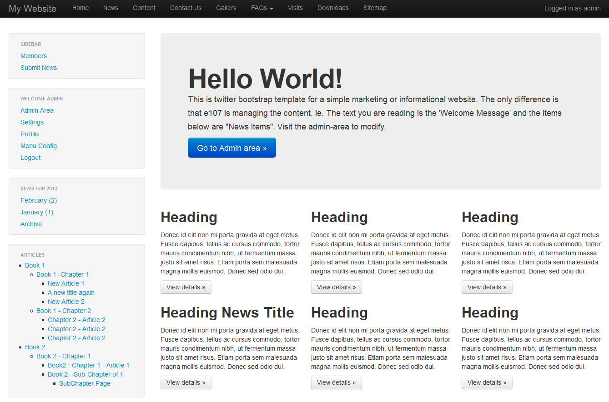
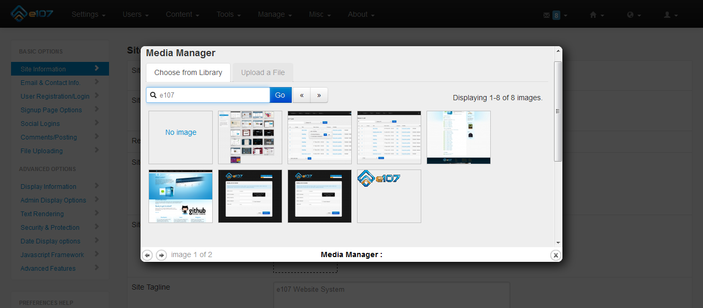
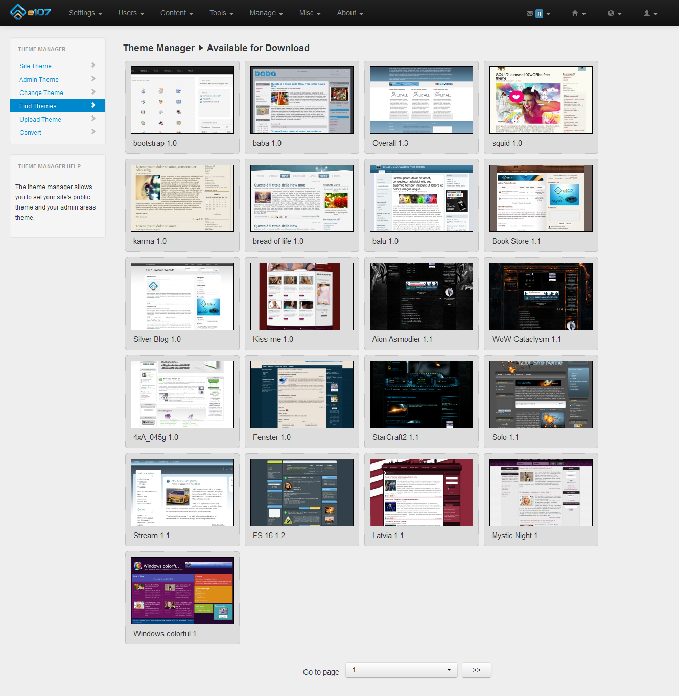
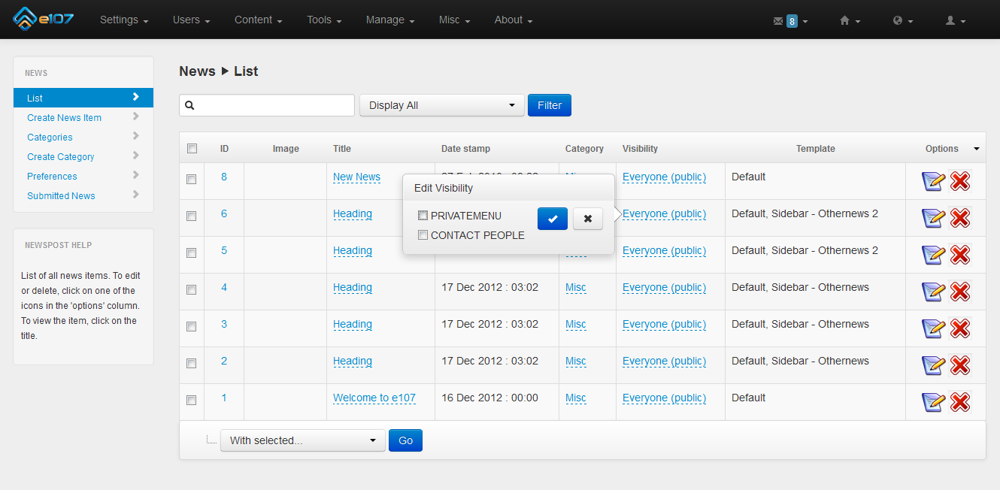
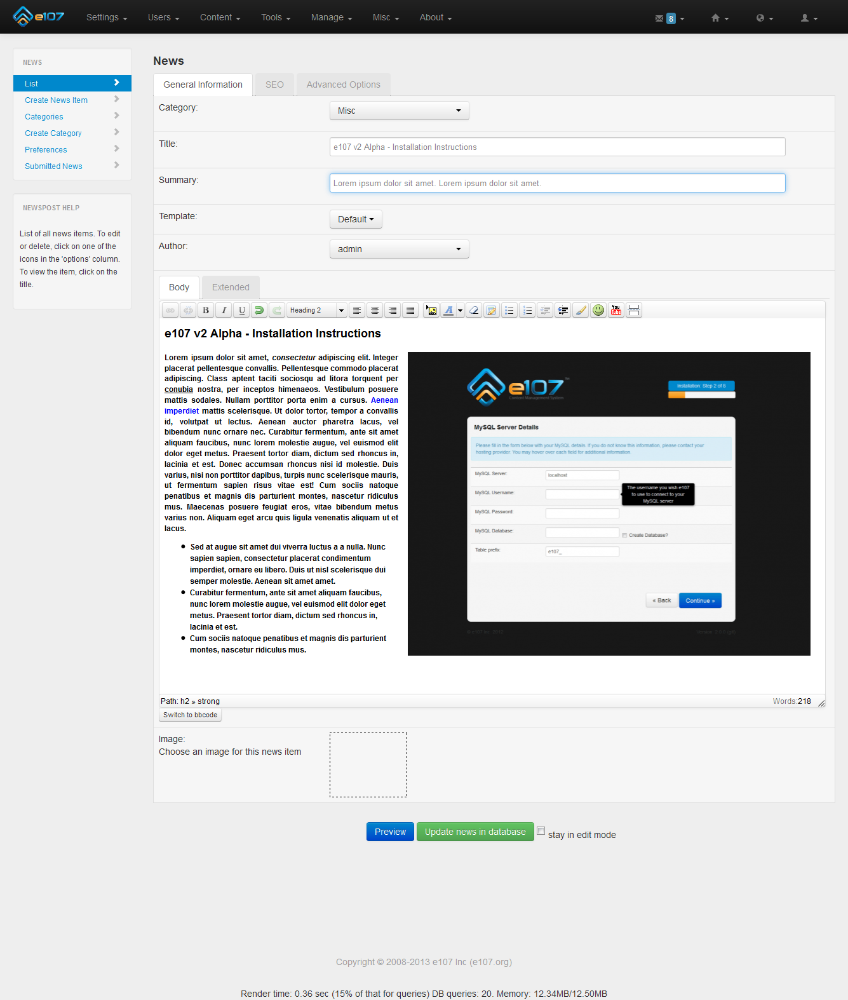
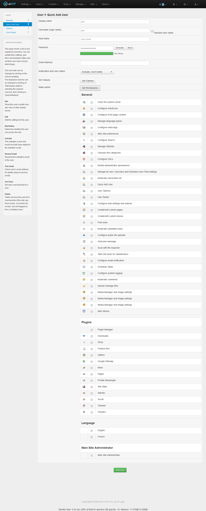
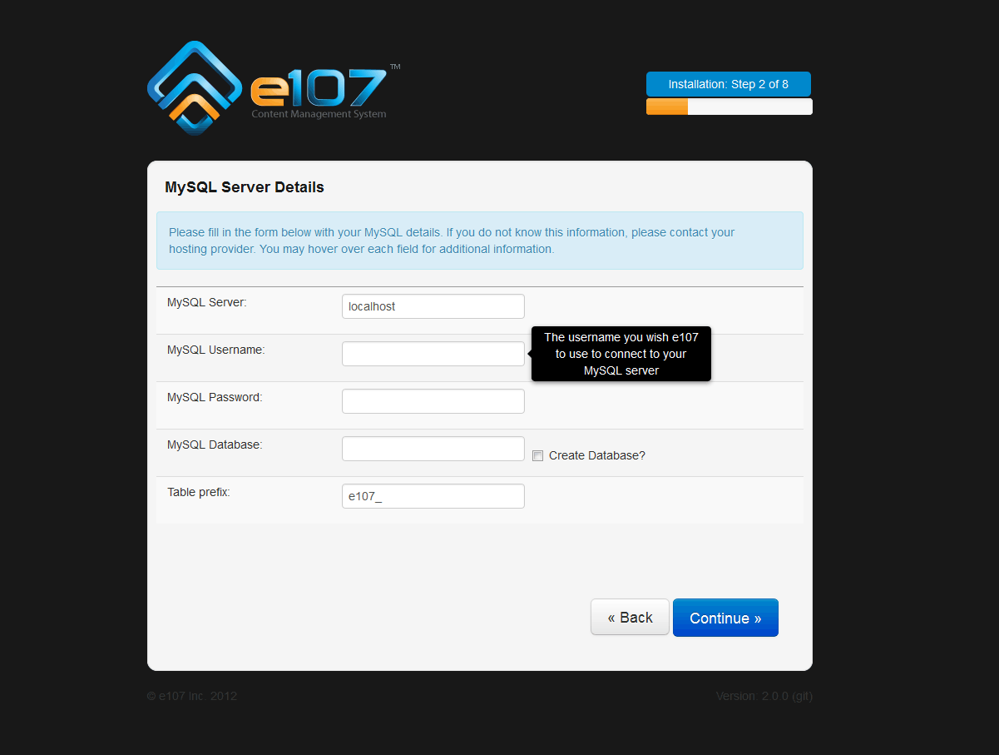
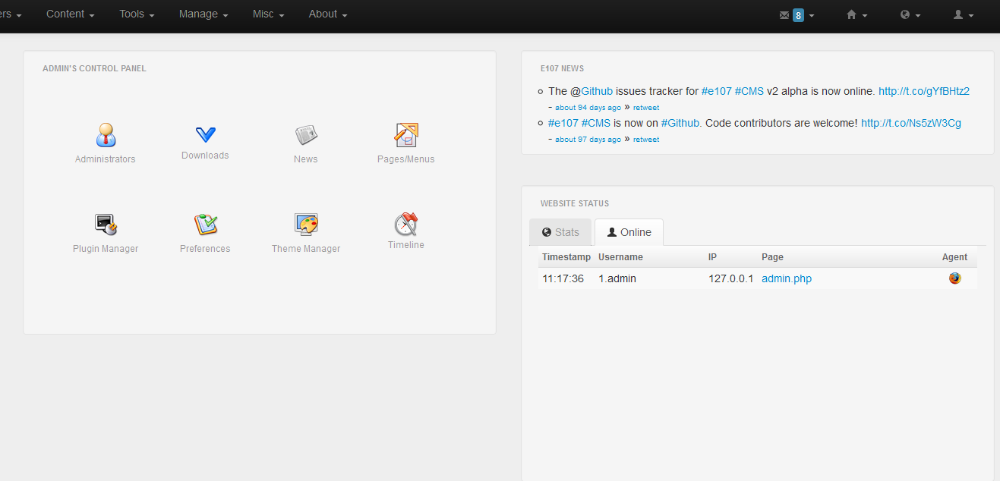

Bootstrap CMS built with e107
=============================

If you are looking for a Content Management System (CMS) built with Boostrap, PHP and MySQL, [You have come to the right place][1].

[Click here][2] to fork or contribute.

### Screenshot 1:  Front-end home

### Screenshot 2:  Media manager 

### Screenshot 3:  Theme manager - remote install

### Screenshot 4:  Inline Editing

### Screenshot 5:  WYSIWYG

### Screenshot 6:  Quick-add user

### Screenshot 7:  Installation

### Screenshot 8:  Admin area home

  [1]: https://github.com/e107inc/e107
  [2]: https://github.com/e107inc/e107

